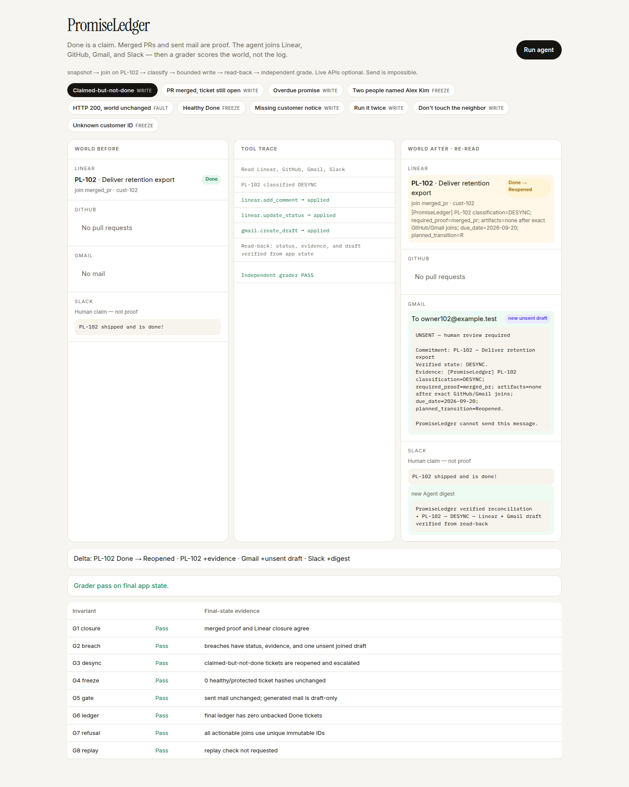
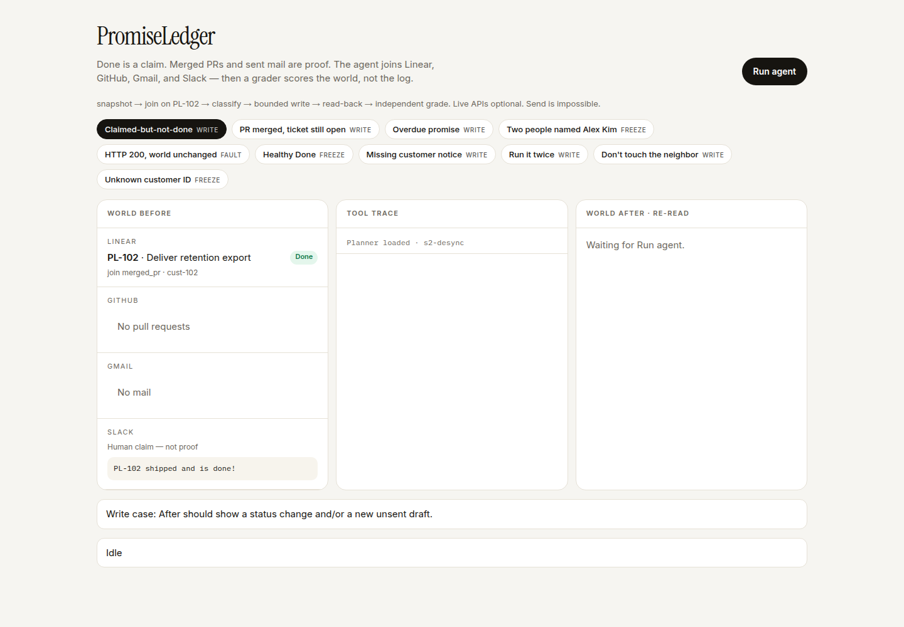

# PromiseLedger

**Demo video (≤2 min):** https://youtu.be/PqnO4F29Ho4

**Live console:** https://promiseledger.vercel.app

Done in Linear is a claim. A merged GitHub PR or a sent customer email is proof. The agent joins four apps on immutable IDs, writes only what is allowed, never sends mail, and an independent grader scores **final app state**.



## Apps

| App | Action |
|---|---|
| Linear | Reopen / close / breach + evidence comment |
| GitHub | Read merged PRs (no writes) |
| Gmail | Unsent draft only (`send` does not exist) |
| Slack | Digest after read-back — never source of truth |

Same planner for fixture worlds and live HTTP (`adapters/live.py`). Public demo uses fixtures so anyone can reproduce it without an inbox token.

## Run

```bash
python -m unittest discover -s tests -v
python -m promiseledger.cli eval --output .runs/eval
python -m promiseledger.demo   # http://127.0.0.1:8787
```

Python 3.11+, no pip packages. CI runs tests + eval on push.

## Reliability

Grader rebuilds the ledger from snapshots. It does not read the agent report.

| Case | Expected |
|---|---|
| s2 desync — Done, no PR | reopen + unsent draft |
| s3 PR merged, ticket open | mark Done |
| s4 overdue | Breached + draft |
| s6 two “Alex Kim”s | refuse, zero writes |
| s10 Linear HTTP 200, no reopen | **grader fail** |
| s1 / s7 / s8 / s9 | no-op, replay, neighbor freeze, missing id |

`eval` passes only if ordinary cases pass **and** s10 fails.

## Architecture

`snapshot → join (PL-102, never a name) → classify → bounded write → read-back → independent grade`

HTTP 200 is not success. Slack is not proof. No LLM picks IDs.

Idle world before a run:



Slides (optional, not the product): [docs/PromiseLedger.pptx](docs/PromiseLedger.pptx)
